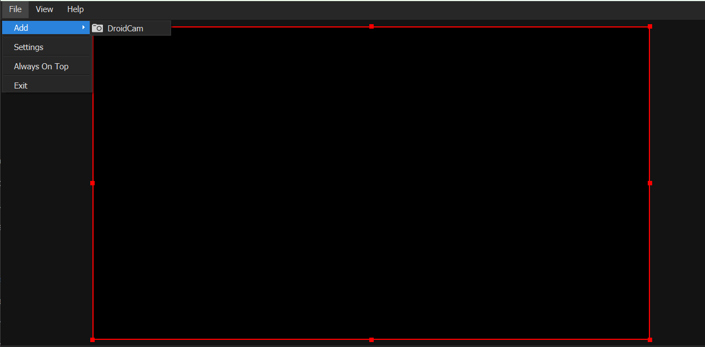
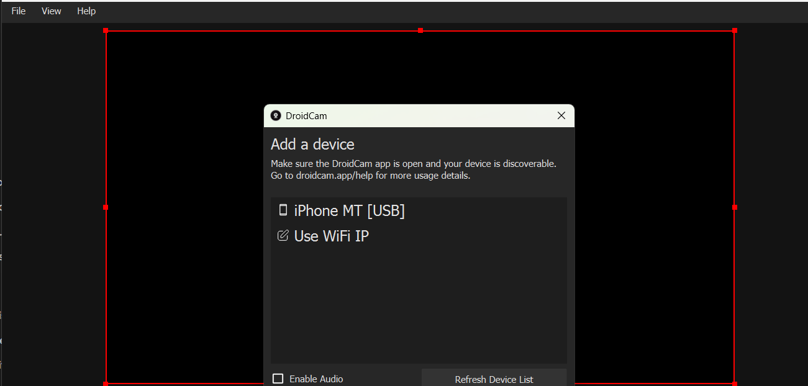
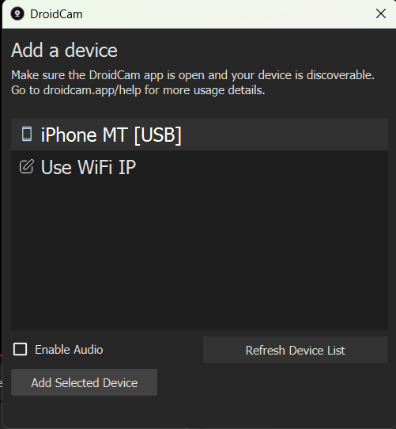

# iPhone Camera Setup

This guide covers connecting an iPhone as a camera source for `camera_utils.py`, either over Wi-Fi or via USB, using the [DroidCam](https://droidcam.app/) app.

**Prerequisite:** install the DroidCam app from the App Store on your iPhone.

## Option 1: Wi-Fi connection

1. Open the DroidCam app on the iPhone.
2. Make sure the iPhone and the PC are on the **same network** (see [Troubleshooting](#troubleshooting) if they can't reach each other).
3. Note the IP address and port shown in the DroidCam app.
4. Connect via OpenCV using that IP/port.

**Test function:**
```python
CameraProcessing().iphone_camera_connection(ip_address="192.168.0.112", port=4747)
```

## Option 2: USB connection

1. Open the DroidCam app on the iPhone.
2. Open the DroidCam Client app on the PC.
3. Add the iPhone as a device:

   
   
   

4. Connect it in the app, then leave it running (minimized is fine).
5. Connect via OpenCV using the camera index DroidCam registers as a virtual webcam (usually `1` or `2`; run `CameraProcessing.list_cameras()` to check).

**Test function:**
```python
CameraProcessing.webcam_connection(index=1)
```

## Troubleshooting

- **Black screen / no frames:** don't force `cv2.CAP_DSHOW` for the DroidCam virtual device — some DroidCam builds only register properly under the default (MSMF) backend, and forcing DirectShow can open the device but return empty frames.
- **Wi-Fi connection fails (`Error number -138` / connection refused):** most commonly caused by **AP/client isolation** on the Wi-Fi network (common on university/enterprise networks), which blocks device-to-device traffic even on the same SSID. Verify with `ping <iphone-ip>` and `Test-NetConnection -ComputerName <iphone-ip> -Port 4747` from the PC. If that fails, try a personal hotspot or the USB connection instead.
- **USB "just works" where Wi-Fi didn't:** connecting via USB creates a direct link between the iPhone and PC that bypasses the Wi-Fi router entirely, sidestepping any network-level isolation.
- **Frame size not applying:** `cv2.set(CAP_PROP_FRAME_WIDTH/HEIGHT, ...)` has no effect on the Wi-Fi stream — DroidCam encodes at a fixed resolution before OpenCV ever sees it. Resize client-side after `cap.read()` instead (handled automatically by `CameraProcessing.read_frame()`).
- **Dropped connection mid-stream:** `CameraProcessing.read_frame()` automatically retries the connection (see `reconnect_max_retries` / `reconnect_delay` in `CameraConfig`) if a frame read fails.
