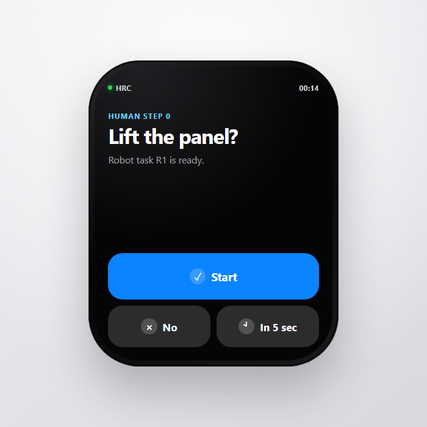

# HRC watch interface demo

This is a minimal FastAPI-backed browser demo for one Human Step 0 interaction:

The R1 permission question supports `H_ACCEPT`, `H_REFUSE`, and `H_DEFER`.



Install the backend dependencies from the repository root:

```powershell
uv pip install --python .venv\Scripts\python.exe -r Interface\requirements.txt
```

Start the FastAPI backend:

```powershell
.venv\Scripts\python.exe -B Interface\server.py
```

Then open `http://127.0.0.1:8765` and select one response. The selected response
is sent to `/api/permission`; the demo does not proceed to robot execution or
other commands.

After backend acknowledgement, the page emits a browser event named
`hrc-permission-response`. Its detail uses the same permission event names as
the Python system:

```javascript
window.addEventListener("hrc-permission-response", (event) => {
  console.log(event.detail);
});
```

The FastAPI backend validates and acknowledges the permission response only. It
does not start the main HRC runtime, send Grasshopper or ROS commands, or control
a robot.
