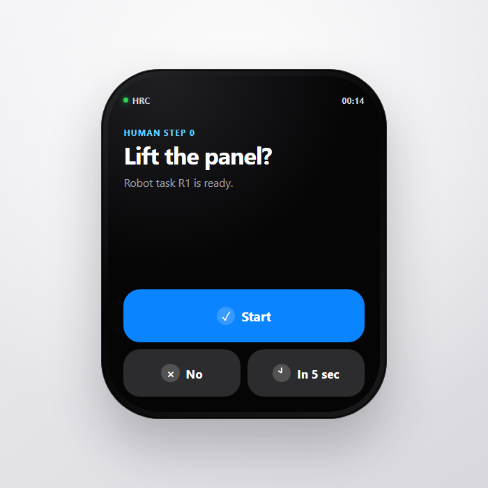
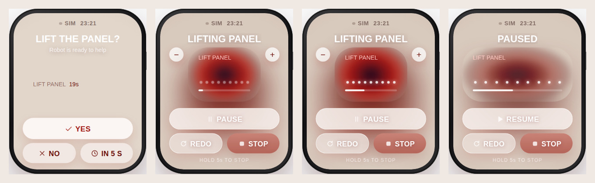

# HRC watch interface demo

This is a FastAPI interface for one Human Step 0 interaction. FastAPI and the
existing HRC communication runtime run in the same process and share the same
event queue.

The R1 permission question supports `H_ACCEPT`, `H_REFUSE`, and `H_DEFER`.



Install the backend dependencies from the repository root:

```powershell
uv pip install --python .venv\Scripts\python.exe -r Interface\requirements.txt
```

Start the integrated FastAPI and HRC communication runtime:

```powershell
.venv\Scripts\python.exe -B Interface\server.py
```

Run this command instead of `run_communication.py`, because both programs would
otherwise try to bind the same recognition-event UDP port. Recognition events
arrive through the existing configured event transport. For an H0 test without
the recognition process, start with:

```powershell
.venv\Scripts\python.exe -B Interface\server.py --debug-trigger
```

Then open `http://127.0.0.1:8765`. The page polls `GET /api/permission` and only
enables its buttons while a real Human Step 0 task is in `R_WAITING_RESPONSE`.
The selected response is sent to `POST /api/permission` with the current
`task_instance_id`.

After backend acknowledgement, the page emits a browser event named
`hrc-permission-response`. Its detail uses the same permission event names as
the Python system:

```javascript
window.addEventListener("hrc-permission-response", (event) => {
  console.log(event.detail);
});
```

The backend converts the response into the project's core `Event`, puts it in
the shared `HRCSystem.event_queue`, and immediately processes it through
`TaskManager`. Therefore `H_ACCEPT`, `H_REFUSE`, and `H_DEFER` now have the same
business behavior as their CLI and voice equivalents. In particular, accepting
uses the normal Grasshopper task dispatch path.

## State-driven watch + simulator (all tasks, all states)

`/watch` and `/sim` show one screen for every robot task state (ask, running,
paused, free drive, holding, stop/recovery, pending). The backend decides what
is on screen (`watch_screens.py`), the page only renders it. See
[UX_GUIDE.md](./UX_GUIDE.md) for the design rules and the screen map.



Run without robot, ROS, Grasshopper or microphone:

```powershell
.venv\Scripts\python.exe -B Interface\server.py --simulate
```

Open `http://127.0.0.1:8765/sim`. The left side is the watch (Apple Watch or
round Wear OS). The right side is a Wizard-of-Oz panel: fake LSTM triggers
(H0, H4, H5), fake robot events, "auto robot" and "safe home zone" toggles, and a
session log you can download as CSV.

With the real system, start as before (without `--simulate`) and open `/watch`.
To wear it, start with `--host 0.0.0.0`, and on a phone on the same Wi-Fi
open `http://<laptop-ip>:8765/watch` (`?shape=round` for a round layout). The
phone vibrates on new questions (Android; iOS Safari has no vibration API).

| Endpoint | Purpose |
|---|---|
| `GET /api/watch` | Snapshot: state, task, screen, speed, pending, recent messages |
| `POST /api/watch/command` | `{"command": "H_PAUSE", "task_instance_id": "..."}` - only commands shown on the current screen are accepted (409 otherwise) |
| `POST /api/sim` | Simulator only: `RECOGNITION_TRIGGER` (+`step_id`), `ROBOT_RUNNING`, `ROBOT_SUCCESS`, `ROBOT_HOMED`, `SETTINGS` |

Tests:

```powershell
.venv\Scripts\python.exe -m unittest Interface.test_watch Interface.test_server
```
